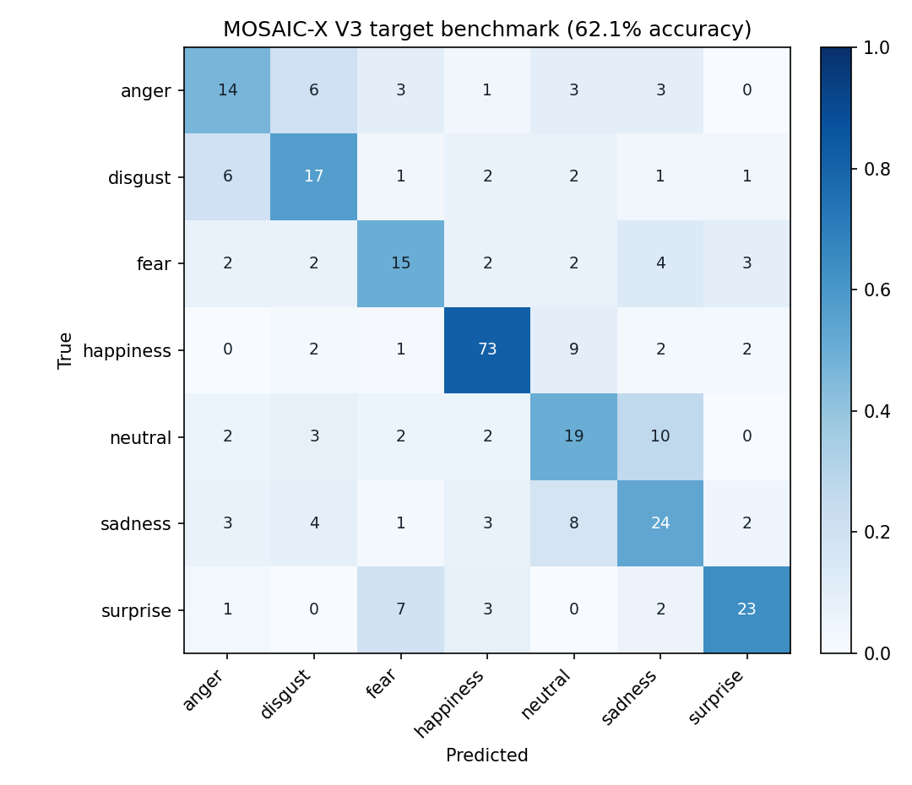

# MOSAIC-X: An Uncertainty-Aware Social-Cue Learning System

**Notice cues. Consider possibilities. Ask with kindness.**

A privacy-focused Flask research prototype that helps learners explore **social cues without claiming to read minds**.
MOSAIC-X combines probabilistic situational context, optional facial-expression cues and explicit self-report with
transparent evidence weights. It also exposes its evaluation, data audit, calibration and failure modes in the UI.
An optional fine-tuned EfficientNetB0 model reads the facial expression from a webcam frame or uploaded photo.

The primary learning experience is **Notice → Consider → Ask**. Learners practise separating
observable facts from assumptions, generating several plausible explanations, and selecting a
respectful check-in that preserves the other person's agency. This activity works without a camera
or model, and progress remains in the browser. Facial-expression classification is an optional,
imperfect cue—not the educational goal and never evidence of a person's diagnosis or inner state.

## What I built

| Area | What it does | Evidence |
|---|---|---|
| **Leakage audit** | Found that an early 93% accuracy came from validation images duplicated from training; rebuilt a deduplicated, label-conflict-free split with an assertion that no image crosses splits | [What I found in the data](#what-i-found-in-the-data-and-fixed) |
| **Calibrated vision model** | EfficientNetB0 fine-tuned after FER-2013 pre-training: 62.1% accuracy / 0.576 macro-F1 on a 298-image held-out benchmark, vs. 43.6% for a HOG + SVM baseline. Temperature scaling (ECE 0.048) and abstention: 69.7% accuracy at 73% coverage | [Results](#results) |
| **Reasoning engine** | Flask-independent service fusing context, expression and self-report with visible weights; self-report has priority and uncertain face evidence is ignored. 126-case behavioral suite | [Reasoning engine](#reasoning-engine) |
| **LLM check-in feedback** | Offline rule reviewer plus an opt-in LLM reviewer with validated JSON output and a visible rule fallback; preliminary 138-message benchmark of hard cases (sarcasm, polite pressure, presupposing questions) | [Check-in feedback](#check-in-feedback-rules-vs-llm-preliminary-benchmark) |
| **From-scratch inference** | MobileNetV2 re-implemented in NumPy with folded BatchNorm, verified against the Keras reference | [How the model works](#how-the-model-works) |
| **Engineering** | 47 unit/API tests in GitHub Actions CI, Docker, model / dataset / system cards, privacy-first defaults | [Tests](#tests) |

## Reasoning engine

The evidence lab now calls a reusable, versioned reasoning service rather than combining
scores only in browser JavaScript. `POST /api/reason` accepts context probabilities, an
optional face-model response, and optional self-report. It returns ranked possibilities,
source weights, missing information, an abstention decision, guidance, and a disclaimer.
The implementation lives in `reasoning_engine.py`, separately from Flask and vision inference.

Run its automated behavioral evaluation with:

```bash
python scripts/evaluate_reasoning.py
```

This generates `data/mosaic_bench.jsonl` and `reports/reasoning_eval.json`. The 126-case
suite checks self-report priority, rejection of uncertain face evidence, context consistency,
and output-schema validity. These deterministic engineering checks do **not** represent
100% real-world emotion-recognition accuracy.

## Check-in feedback: rules vs. LLM (preliminary benchmark)

After choosing a response, learners can write the check-in **in their own words** and get feedback on the
wording. `message_feedback.py` scores a message on four criteria defined in
[`data/checkin_labeling_guide.md`](data/checkin_labeling_guide.md): *assumes a feeling*, *judgmental*,
*pressuring* and *checks in*. The overall "respectful" verdict is derived from them.

Two reviewers share one output schema:

* **Rules (default, offline).** A deterministic lexicon baseline run by the app's own server. The message is not
  saved and is not sent to any external AI provider. (It reaches your machine only if you run the server locally.)
* **LLM (opt-in).** Anthropic or any OpenAI-compatible API, enabled with `MOSAIC_LLM_PROVIDER` and a key. Output is
  parsed as strict JSON and validated. On a network error or malformed output, the rule reviewer answers and the
  response is marked `fallback`, so failures are never silent. The UI tells the learner when their text is sent to
  the provider and asks them not to enter private or sensitive information. Retention by the provider depends on
  its API terms, so the app makes no "not stored" promise in this mode.

**Benchmark (preliminary).** 138 hand-labeled messages (45 dev / 93 held-out test) weighted toward hard cases: sarcasm, polite
pressure, presupposing questions ("Why are you so upset?"), hedged checks ("You seem quiet. Am I reading that
right?"), negation and mixed messages. The test split was written before the rules and was not used to tune them.

| Held-out test (n = 93) | Always-majority | Rules |
|---|---|---|
| Assumes a feeling (F1) | 0.000 | 0.917 |
| Judgmental (F1) | 0.000 | 0.780 |
| Pressuring (F1) | 0.000 | 0.857 |
| Checks in (F1) | 0.000 | 0.946 |
| **All four criteria right** | 3.2% | **77.4%** |
| Overall verdict right | 61.3% | 95.7% |
| Disrespectful messages approved as respectful | – | **0** |

**What the failures show.** The verdict looks strong (95.7%), but it is often right for the
wrong reason. The rules missed the judgment in 3 of 5 sarcastic messages ("Nice of you to finally join us.") and
the implied feeling in the other 2, yet still called all 5 "not respectful", because none contains a question or offer. Judgmental recall is only
0.64. The rules also fail on negation ("I don't know how you're feeling, so I wanted to
ask.") and implicit commands ("Grow up."). These are meaning problems, not keyword problems, and they are what the
LLM reviewer is meant to fix. Per-criterion scores and exact match are therefore reported next to verdict accuracy.

**Run it:**

```bash
python scripts/evaluate_feedback.py                     # rules, held-out test split
MOSAIC_LLM_PROVIDER=anthropic ANTHROPIC_API_KEY=sk-... \
    python scripts/evaluate_feedback.py --backend llm    # LLM; raw outputs cached for reproducibility
```

Both write `reports/feedback_eval_<backend>_test.json` with every failure listed, and the Evaluation lab shows the
comparison. **Limitations:** a single person wrote and labeled every message, so there is no inter-annotator
agreement yet, and the rules' test score is likely optimistic. The scores measure agreement with that one person's
rubric, not real-world helpfulness. Exact match (all four criteria) is the more informative number; verdict accuracy
is shown because it looks good while hiding errors. **No LLM results are reported yet.** Next steps: independent
relabeling of the test split with agreement (Cohen's kappa), then a measured LLM run.

## Activities

| Activity | What the learner does |
|---|---|
| 🧠 **Evidence lab** | Combines probabilistic context, optional expression cues and self-report with visible weights. |
| 🔍 **Explore** | Sees which of 7 emotions their face shows right now, with plain-language tips (“corners of the mouth go up”). |
| 🪞 **Mirror game** | Is asked for a face (“Can you make a surprised face?”) and holds it until the bar fills, earning a star. |
| 🧩 **Feelings quiz** | Reads a short everyday situation (“Zoe's best friend is moving away”) and picks how the person might feel, with a one-line explanation; optional photo mode. |
| 🎵 **Music feelings** | Plays a song; the app records a timeline of their facial reactions and shows a summary. |
| ⭐ **Progress** | For parents/teachers: success per emotion over time, stored only in the browser, exportable as JSON. |
| 📊 **Evaluation lab** | Exposes held-out metrics, calibration, data audit and known failures instead of hiding them. |

### Learning design

The app does not teach that a situation has one compulsory emotion. Ambiguous stories accept multiple
reasonable answers, explain that people can react differently, and suggest a supportive next action. Mirror practice is adaptive: expressions
with more unsuccessful attempts are offered more often, while calibrated low-confidence predictions never
earn or remove a star. This makes the model a fallible practice aid rather than an authority on feelings.

---

## Results

All numbers are on a **298-image target benchmark** excluded from gradient training and validation selection.
Because results from multiple versions have now been inspected, it is treated as a development benchmark rather
than a permanently untouched final test.
Random guessing across 7 emotions would score about 14%.

| Model | Test accuracy | Macro F1 | Model size |
|---|---|---|---|
| Majority class (“always happy”) | 29.9% | 0.07 | – |
| HOG + linear SVM (classical baseline) | 43.6% | 0.36 | < 1 MB |
| MobileNetV2 features + calibrated linear/RBF-SVM ensemble | 49.7% | 0.44 | 14.8 MB |
| EfficientNetB0 V1 | 57.1% | 0.526 | 17.1 MB |
| EfficientNetB0 V2 | 61.4% | 0.559 | 17.1 MB |
| **Validation-selected EfficientNetB0 V3 (shipped)** | **62.1%** | **0.576** | **17.1 MB** |
| ~~Original InceptionV3 + Flatten (v1)~~ | ~~93%~~: invalid, see below | – | 409 MB |



* **Strong classes:** happiness (F1 0.83) and surprise (0.69).
* **Weak classes:** neutral (0.47), anger (0.48), and fear (0.50).
* **By source:** 75.8% on the children's photos and 56.0% on the general face set. The children's benchmark subset is mostly
  happy faces, which are the easiest class, so this gap is not evidence that the model works better on children.

This is an honest, modest result for seven target classes after large-source pretraining and target-domain fine-tuning.

**Earlier experiment: classifier heads on frozen MobileNetV2 features (validation only).** This was the
CPU-only model before the EfficientNet fine-tuning; it is kept for comparison, not shipped.

| Head on the same features | Val macro-F1 |
|---|---|
| **Logistic regression (best head)** | **0.477** |
| MLP, 256–1024 hidden units | 0.434–0.465 |
| PCA-512 + logistic regression | 0.439–0.447 |
| Ensembles (LR + LR-GAP, LR + MLP) | 0.437–0.468 |

None beat the simplest head, which suggests that the frozen ImageNet features, not the classifier, are the
bottleneck. That finding motivated moving to full fine-tuning of EfficientNetB0, which is the shipped model.

### Confidence calibration

A confident wrong answer is worse than an honest “I'm not sure.” V3 uses temperature 1.099188
and a 0.425 abstention threshold, both fitted using validation predictions. Validation ECE is
0.0475. With that fixed rule, benchmark accuracy is 69.7% at 73.2% coverage. Accuracy and
coverage must always be reported together.

### What I found in the data (and fixed)

The first version of this project reported **93% validation accuracy**. When I audited it:

1. **Train/validation leakage.** All 420 “validation” images were byte-for-byte copies of training images, so the
   model was evaluated on photos it had memorised. Validation accuracy (93%) being *higher* than training accuracy
   (83%) was the giveaway.
2. **Contradictory labels.** In the children's dataset, about 100 images in the `sadness` folder were exact copies
   of images also filed under `anger`, `fear` or `surprise`, and 4 images in the general set had the same problem.
   Because the true label can't be known, these 112 images are dropped. As a result, the children's data has no
   usable `anger` examples.
3. **Training quirks.** `steps_per_epoch` made every second epoch empty (50 real epochs, not 100), and the
   augmentation generator was overwritten, so augmentation never ran.

`scripts/split_dataset.py` pools every image, removes exact and perceptual-hash duplicates, drops label conflicts,
makes a stratified 70/15/15 split per source and label, and **asserts that no image appears in two splits**.
After cleaning, 1,986 of 2,653 files remain (train 1,390 / val 298 / test 298).

### How the model works

**Shipped model: EfficientNetB0 V3** (`models/emotion_model.keras`, trained with `scripts/train.py`)

* **Pre-training:** ImageNet weights, then source pre-training on 33,977 exact-deduplicated FER-2013 images.
* **Target fine-tuning:** full fine-tuning on the cleaned, leak-free target split. Three seeds, model-weight
  interpolation with V2, and flip test-time augmentation were compared using **validation macro-F1 only**;
  the selected configuration (seed 79, no soup, no TTA) was then run once on the benchmark.
* **Calibration:** temperature scaling (T = 1.099) and a 0.425 abstention threshold, both fitted on validation.
* **Preprocessing matches the app:** training photos are cropped with the same face detector and margin the app
  uses on webcam frames.

**Earlier CPU-only model: MobileNetV2 in NumPy** (`models/emotion_model.npz`, kept for comparison)

* **Backbone:** MobileNetV2 with the official Keras ImageNet weights, **re-implemented in NumPy**
  (`mobilenet_np.py`), with BatchNorm folded into the convolutions. A unit test checks it against the Keras
  reference: it classifies the standard Grace Hopper test image as “military uniform” (87.6%), matching Keras.
* **Features:** global-average-pooled features plus 2×2-grid-pooled features from three depths (7,424 dimensions).
  Keeping this coarse layout beat plain global pooling on validation (macro-F1 0.477 vs. 0.458).
* **Heads:** a calibrated class-balanced logistic regression blended with a PCA-256 RBF-SVM (70/30), reaching
  49.7% accuracy / 0.442 macro-F1. Runs with only NumPy and OpenCV at about 120 ms per face on a laptop CPU.

---

## Privacy & safety by design

The first version emailed webcam snapshots to a fixed address and had a Gmail password in the source code.
This version:

* **Images are sent to the app server for temporary inference, are not intentionally stored, and are not
  forwarded to a third party.** The browser sends a frame to the Flask server (your own computer when run locally),
  gets a prediction back, and the frame is discarded after inference.
* **Keeps audio in the browser.** Songs are never uploaded.
* **Check-in feedback uses offline rules by default.** Messages are processed by the app's server and not saved.
  The optional LLM reviewer is off unless configured; when on, the page says the text goes to the AI provider and
  asks learners not to enter private or sensitive information.
* **Keeps progress on the device** (`localStorage`), with export and erase buttons.
* **Has no secrets in code.** Configuration comes from environment variables (`.env.example`), and the server binds
  to `127.0.0.1` by default.
* Uses a calm, low-stimulation UI: soft colours, no flashing, large targets, a mute button and
  `prefers-reduced-motion` support.

## Limitations

* **Accuracy is still modest (62.1% overall).** The app should encourage practice, not
  grade a learner. The mirror game needs the expression held for about 2 seconds, which reduces frustration from
  one-frame misreads.
* **Expressions ≠ emotions.** The model classifies facial *expressions*. Many people, and many autistic people,
  feel emotions without showing the prototypical face. The scientific validity of inferring emotion from faces is
  contested (Barrett et al., 2019, *Psychological Science in the Public Interest*).
* **Not a diagnostic tool.** It does not assess autism or any condition, and it has not been evaluated with
  autistic children or clinicians.
* **Small, uneven data.** About 2,000 images from two datasets; not balanced by age, gender or skin tone, and no
  children's anger examples. I have not measured subgroup performance.
* Haar-cascade face detection misses faces in profile or in poor lighting.

## Next steps

* Evaluate once on a new external, identity-separated test set before making a final unbiased claim.
* Evaluate per subgroup (age, skin tone) and report it.
* Move inference fully into the browser (TensorFlow.js or ONNX Runtime Web), then host the app on GitHub Pages.
* Replace the Haar cascade with a modern detector such as MediaPipe or YuNet.
* Run a small usability study with educators or therapists before claiming any benefit.

---

## Run it

> **Model weights are not included in this public repository.** They were trained on third-party datasets whose
> licenses are still being confirmed, so only the code, evaluation reports and documentation are published. Everything
> except the camera activities (Explore, Mirror game, Music) works without them. To enable those, train a model with
> the scripts in [Reproduce the training](#reproduce-the-training) and place it in `models/`.


```bash
python -m venv .venv
# Windows PowerShell: .\.venv\Scripts\Activate.ps1
# macOS/Linux: source .venv/bin/activate
pip install -r requirements.txt
python app.py            # open http://127.0.0.1:5000
```

The fine-tuned EfficientNet model (`models/emotion_model.keras`) is not included in the public repository (see the note above). If the selected model is missing, the UI still runs and shows a
banner explaining what's needed.

## Reproduce the training

**Shipped EfficientNet model (GPU):** see the FER-2013 pre-training command below, or run
`notebooks/train_colab.ipynb` on a free Colab T4.

**Legacy CPU pipeline:** put the two raw datasets in `data/raw/dataset` (7 folders: anger … surprise) and `data/raw/dataset1`
(anger, fear, joy, Natural, sadness, surprise), then:

```bash
pip install -r requirements-train.txt
python scripts/split_dataset.py --source general=data/raw/dataset --source kids=data/raw/dataset1 --out data/split
python scripts/baseline_hog_svm.py --data data/split --out reports/baseline

# ImageNet weights (Apache-2.0), the same file Keras uses:
curl -LO https://github.com/JonathanCMitchell/mobilenet_v2_keras/releases/download/v1.1/mobilenet_v2_weights_tf_dim_ordering_tf_kernels_1.0_224_no_top.h5
python scripts/convert_mobilenetv2.py mobilenet_v2_weights_tf_dim_ordering_tf_kernels_1.0_224_no_top.h5 models/mobilenetv2_imagenet.npz
python scripts/train_numpy.py --data data/split --backbone models/mobilenetv2_imagenet.npz   # ~30 min on 2 CPU cores
python scripts/calibrate.py --model models/emotion_model.npz --data data/split                # ~2 min
```

Optional full fine-tuning on a GPU: `python scripts/train.py` or `notebooks/train_colab.ipynb` (free Colab T4).

For the best performance path, pre-train the seven-class head on a cleaned, larger dataset such as FER-2013,
then fine-tune on the leak-free target split:

```bash
python scripts/train.py --data data/split --pretrain-data data/fer2013
python scripts/calibrate.py --model models/emotion_model.keras --data data/split
```

The external dataset must use the seven canonical folder names listed above. Keep its validation set separate;
never add any target test image to pre-training. A new accuracy number should be published only after evaluation
on a new external test set that has not been used during this development cycle.

## Tests

```bash
python -m unittest discover -s tests -v
```

The 47 tests cover:

* face detection and preprocessing (checking that it matches training);
* every page and API route, input validation and the upload size limit;
* the story quiz (valid choices, no immediate repeats, all 7 feelings covered);
* the trained model's output (valid probabilities), its calibration, and the “not sure” flag;
* the reasoning engine: self-report priority, ignoring uncertain face evidence, and payload validation;
* the Evaluation lab rendering the shipped V3 metrics;
* check-in feedback: rule behavior on edge cases, LLM JSON validation and visible fallback (with a fake network),
  opt-in configuration, the `/api/feedback` route, and benchmark integrity (disjoint splits, derived labels);
* the NumPy MobileNetV2 against the Keras ImageNet reference;
* a check that no email or password code is present.

Browser flows (camera, mirror game, music summary, progress) were tested in headless Chromium with a fake webcam.

## Project structure

```
app.py                      Flask routes: pages + /api/predict, /api/reason, /api/status, /api/quiz/next
emotion_model.py            face detection, cropping, preprocessing, model loading (.npz or .keras)
message_feedback.py         check-in feedback: offline rule reviewer + optional validated LLM reviewer
reasoning_engine.py         context + expression + self-report evidence fusion (Flask-independent)
mobilenet_np.py             MobileNetV2 inference in NumPy (legacy CPU model)
templates/, static/         UI (vanilla JS; webcam via getUserMedia)
scripts/split_dataset.py    dedupe + leak-free stratified split
scripts/baseline_hog_svm.py classical baseline
scripts/convert_mobilenetv2.py  Keras .h5 weights -> folded NumPy weights
scripts/train_numpy.py      trains the legacy NumPy model (features + logistic regression)
scripts/calibrate.py        temperature scaling + "not sure" threshold, reliability plots
scripts/train.py            EfficientNetB0 fine-tuning (GPU) - trains the shipped model
scripts/evaluate_reasoning.py  126-case behavioral suite for the reasoning engine
scripts/build_checkin_eval.py  writes the hand-labeled check-in benchmark (data/checkin_eval.jsonl)
scripts/evaluate_feedback.py   rules vs. LLM on that benchmark: per-criterion P/R/F1, exact match, failures
scenarios.py                42 everyday situations for the story quiz
communication_scenarios.py  Notice -> Consider -> Ask practice scenarios
reports/                    metrics_v3.json (shipped), earlier-version metrics, baseline, calibration
MODEL_CARD.md               intended use, metrics, limitations and prohibited uses
DATASET_CARD.md             provenance requirements, leakage audit and known data gaps
tests/test_app.py
```

## License

No open-source license has been chosen yet, so all rights are reserved by the author. You are welcome to read the
code; please ask before reusing it. Third-party datasets are not included, and trained model weights remain subject
to the terms of the data they were trained on.

## Data & credits

* General facial-expression dataset (7 classes) and children's emotion dataset (6 classes): publicly available
  datasets downloaded from Kaggle. The exact dataset pages and licenses are being confirmed and will be linked here.
  The images are not redistributed in this repository, and the trained models are shared for research and
  education only.
* FER-2013 (used only for source pre-training of the shipped EfficientNetB0 model): originally released for the
  ICML 2013 Workshop on Challenges in Representation Learning; I. J. Goodfellow et al., "Challenges in Representation
  Learning: A report on three machine learning contests," ICONIP 2013. Folder-format copy from Kaggle
  ([msambare/fer2013](https://www.kaggle.com/datasets/msambare/fer2013)), listed there under
  "Database: Open Database, Contents: Database Contents" (ODbL 1.0 / DbCL 1.0). Not redistributed here.
* UI line icons: [Feather](https://feathericons.com) (MIT License), inlined in `templates/_icons.html`.
* MobileNetV2 ImageNet weights: Keras Applications / TensorFlow Models (Apache-2.0)

The images are not redistributed in this repository.
